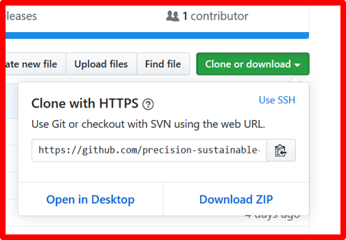

Extending the PSA On-farm Dashboard
================

> Note: the audience for this tutorial is the PSA team for extending the <https://crownproject.org> dashboard. If you're a visitor to our repo and not part of the team, the code is MIT-licensed for you to copy and learn from, but you won't be able to deploy and develop this app in particular.

Clone this repository
---------------------

-   Get `git` setup on your computer: <https://www.linode.com/docs/development/version-control/how-to-configure-git/>
-   If fun videos are more your speed, try: <https://www.youtube.com/playlist?list=PLRqwX-V7Uu6ZF9C0YMKuns9sLDzK6zoiV>

Once you've got `git` installed, clone this repo to your machine. You can do this at the command line, like with `bash`/Terminal on a Mac or `PowerShell` or `cmd` on Windows.

``` bash
cd your/working/directory/of/choice
git clone https://github.com/precision-sustainable-ag/on-farm-dashboard.git
```

Alternatively, you can forgo git and download the project directly from the repository, but then your changes won't be tracked and will have to be manually merged in.



Now you'll have a folder called `on-farm-dashboard` with all\* the files you need.

> \*There will be one missing file, `secret.R`. This has the username and password for the database to log in, etc. You'll have to get this directly from me (Brian), or get new login details from Rohit or Aurélie.

### `secret.R`

``` r
# DB credentials
pg_dbname = "<Postgres db name>"
pg_host = "<Host URL>"
pg_port = 0000
pg_user = "<your username>"
pg_password = "<your password>"

# Soil water sensor summary
soil_water_gs_key = "<long identifier for a Google Sheet>"
```

If you're developing a new module for the dashboard, you may need to add additional secret keys into this file, but those keys will be manually merged, not stored in Github.

Run the project
---------------

Now that the repository is installed, you should be able to open the files in RStudio.


You'll see that in "normal" `.R` files, like `module_biomass.R`, the window looks like you're familiar with. But certain keyword filenames (`server` | `ui` | `app` | `global`), there will be a different button at the top:


You should be able to click this button and some magic happens.

1.  RStudio will start running a local server in the background.
2.  A window will open to access the app being served to your computer, by your computer.
3.  The UI will start to load, with a spinner indicating things are happening.
4.  The server will start talking to the database and Google Sheets, loading data.
5.  The dashboard will be loaded and live.

Troubleshooting
---------------

However, probably one of those steps will fail. The first thing to do is check that you have all the appropriate packages installed. You can see there's a bunch at the top of `server.R`:

#### `server.R` (truncated)

``` r
library(shiny)
library(shinyWidgets)
library(dplyr)
library(googlesheets)
library(ggplot2)
library(tidyr)
library(readr)
library(stringr)
library(lubridate)
library(glue)
library(purrr)
library(leaflet)

# httr::set_config(httr::config(http_version = 0))

library(dbplyr)
library(RPostgres)
```

Hit the "Stop" button if it's running the server still.


Then run each of the `library` lines from `server.R` one at a time to see if the package loads or returns an error. If the R console says something like:

> `Error in library(shiny) : there is no package called ‘shiny’`

Then you'll need to run `install.packages("shiny")`. You'll only have to do this part once, and they're all useful packages to have around on your system.

> You don't have to worry about the commented-out line that configures `httr` options, it'll skip over it automatically.

Now if you click the "Run App" button, you should get further along in the magic steps. If the spinner just keeps on spinning, the database might not be connected. I found this is particularly a problem on unsecured public Wi-Fi. Hit the "Stop" button again, and then check if the DB will connect outside of the Shiny context.

#### `server.R` (truncated)

``` r
library(dbplyr)
library(RPostgres)
con <- dbConnect(
  Postgres(),
  dbname = pg_dbname,
  host = pg_host,
  port = pg_port,
  user = pg_user,
  password = pg_password,
  sslmode = "require"
)
```

If running these lines just completes and returns you to the console, it was successful! If not, it'll hang for a while negotiating with the server, and eventually you might see an error like:

    Error in connection_create(names(opts), as.vector(opts)) : 
      could not connect to server: Connection timed out (0x0000274C/10060)
        Is the server running on host "xxx.postgres.database.yyy.zzz" (00.00.00.00) and accepting
        TCP/IP connections on port 0000?

There's two problems that could be causing this that I know of so far. First, check if the live app is working: <https://crownproject.org>. If that's also failing, then it's my problem, not yours! Let me/Aurélie/Rohit know right away, we might need to just restart things.

However, if the live app is running, but the database won't connect on your computer, it's possible that your network is blocking outgoing traffic on the port. This is mainly a problem on unsecured public networks, like the guest WiFi at businesses and schools. Other than connecting to a different network, I don't have much of a solution for that one. I'm happy to help brainstorm though.

Development
-----------

On that note, the plan is to have development happen collaboratively. If you want to extend the functionality of this dashboard, or deploy your own app, feel free to talk to me about how to design and implement your ideas.

The basic idea is that there are several types of patterns in the existing modules that you can use as templates. If you want to add a new tab and visualize some other data in the database, the workflow is there to copy. If you fit a model locally and want to show how it makes predictions for each farmer's site, you can save your model as a `.RDS` object and upload that into the app. Anything you can do in R, can be done in the dashboard.
